= Elektronische Prüfung zum Erwerb des Leistungsnachweises - Softwareentwicklung I
:icons: font
Prof. Dr. Ullrich Hafner <ullrich.hafner@hm.edu>
:toc-title: Inhaltsverzeichnis
:chapter-label:
:chapter-refsig: Kapitel
:section-label: Abschnitt
:section-refsig: Abschnitt

:xrefstyle: short
:!sectnums:
:partnums:
ifndef::includedir[:includedir: ./]
ifndef::imagesdir[:imagesdir: ./]
ifndef::plantUMLDir[:plantUMLDir: .plantuml/]
:figure-caption: Abbildung
:table-caption: Tabelle

ifdef::env-github[]
:tip-caption: :bulb:
:note-caption: :information_source:
:important-caption: :heavy_exclamation_mark:
:caution-caption: :fire:
:warning-caption: :warning:
endif::[]

== 1. Malen eines Rechtecks - Assignment1Draw

Damit der Start leichter fällt, ist die Aufgabe in Teilschritte aufgeteilt, die im selben Programm umgesetzt werden sollen. Starten Sie mit der Aufgabenstellung zu Aufgabe 1a und verbessern Sie dann Ihren Code schrittweise so, dass er auch die Randfälle der weiteren Aufgaben erfüllt werden. Je nach Geschick kann die Lösung der weiteren Teilaufgaben bereits funktionieren, ohne dass Sie speziell nacharbeiten müssen. Die bereitgestellten Testfälle gelten jedenfalls für alle Teilaufgaben. Alle Aufgabenteile werden innerhalb derselben Java Datei bearbeitet.

=== 1a. Malen eines kompletten Rechtecks

Schreiben Sie ein Programm für Kara, das in einer beliebig großen leeren Welt ein Rechteck vorgegebener Größe an einer bestimmten Position in der Welt malt. Der Eckpunkt links oben sowie die Breite und Höhe des Rechtecks werden durch einen Dialog zu Beginn abgefragt. Das Rechteck soll nicht gefüllt sein. Die Position von Kara am Ende des Programms ist egal und wird nicht überprüft.

In den folgenden Bildern sehen Sie einige Rechtecke, die Ihr Programm malen soll. In den zur Verfügung gestellten Tests gibt es weitere Beispiele, die Sie überprüfen können.

.Male Rechtecke - Links: Ecke (0,0) Größe 4x6 - Mitte: Ecke (0,1) Größe 4x5 - Rechts: Ecke (1,0) Größe 3x3
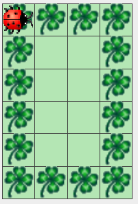
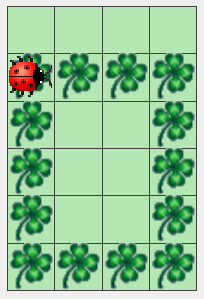
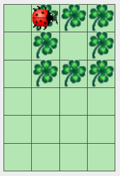

=== 1b. Malen eines degenerierten Rechtecks

Höhe und Breite eines Rechtecks können so klein sein, dass das Bild kein nicht ausgefülltes Rechteck mehr ergibt. Das Programm soll aber dennoch eine Ausgabe erzeugen. Das heißt, wenn die Höhe oder die Breite 1 ist, dann ergibt sich eine horizontale oder vertikale Linie. Sind Höhe und Breite beide 1, dann ergibt sich sogar nur ein Punkt. Im Fall von Höhe und Breite 2 ergibt sich ein ausgefülltes Rechteck. Berücksichtigen Sie alle diese Sonderfälle in Ihrem Programm. Im Idealfall müssen Sie Ihr Programm dazu nicht oder kaum anpassen.

.Male Rechtecke - Links: Ecke (0,5) Größe 4x1 - Mitte: Ecke (3,0) Größe 1x6 - Rechts: Ecke (2,3) Größe 1x1
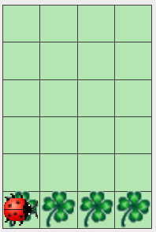
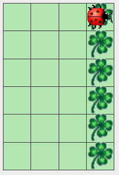
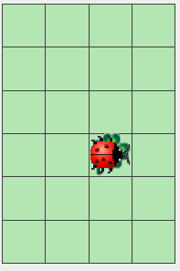

=== 1c. Ignorieren von ungültigen Eingaben

Werden als Startpunkt Koordinaten außerhalb der Welt gewählt, soll Kara gar nichts malen. Ebenso soll bei Höhe und Breite kleiner 1 nichts gemalt werden.

=== 1d. Malen übergroßer Rechtecke

Sollte das zu malende Rechteck nicht ganz in Karas Welt passen (d.h., es ist zu breit oder lang), dann soll nur der sichtbare Bereich gemalt werden. Die restlichen Punkte, die außerhalb der Welt liegen, sollen nicht angezeigt werden. (Diese Punkte dürfen auch nicht auf der anderen Seite dargestellt werden, d.h. die typische Kara Funktionalität, dass Kara auf der jeweils gegenüberliegenden Seite wieder erscheint, wird nicht angewendet). Damit ergibt sich jeweils ein Rechteck mit einer oder zwei offenen Seiten.

.Male Rechtecke - Links: Ecke (3,1) Größe 10x10 - Rechts: Ecke (4,5) Größe 3x5
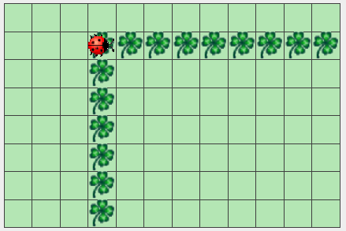
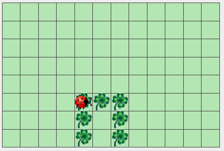

== 2. Finden aller Blätter - Assignment2Count

Damit der Start leichter fällt, ist die Aufgabe in Teilschritte aufgeteilt, die im selben Programm umgesetzt werden sollen. Starten Sie mit der Aufgabenstellung zu Aufgabe 2a und passen Sie am Ende Ihren Code so an, dass auch Aufgabe 2b erfüllt wird. Die bereitgestellten Testfälle gelten für alle Teilaufgaben. Alle Aufgabenteile werden innerhalb derselben Java Datei bearbeitet.

=== 2a. Zählen in einer Welt ohne Pilze

Kara soll in einer von Bäumen umzäunten Welt alle Blätter finden und die Summe der gefundenen Blätter ausgeben. Die Welt ist beliebig groß, der Zaun am Rand ist komplett mit Bäumen besetzt. Innerhalb der Welt können an jeder Stelle Blätter vorhanden sein. Die Welt enthält keine Pilze oder Bäume innerhalb der Umzäunung.

.Zähle Kleeblätter - Links: Eins - Mitte: Fünf - Rechts: Acht
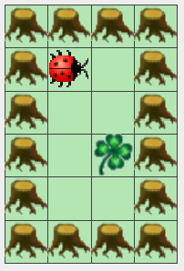
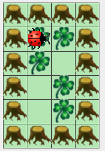
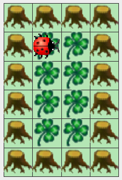

.Zähle Kleeblätter - Links: 4 - Rechts: 20
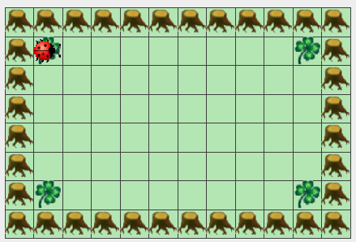
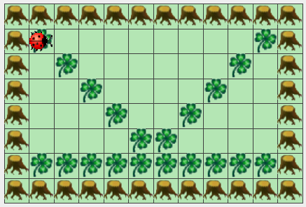

=== 2a. Zählen in einer Welt mit einem Pilz

Es gilt teilweise die bereits bekannte Aufgabenstellung aus 2a: Kara soll in einer von Bäumen umzäunten Welt alle Blätter finden und die Summe der gefundenen Blätter ausgeben. Die Welt ist beliebig groß, der Zaun am Rand ist komplett mit Bäumen besetzt. Innerhalb der Welt können an jeder Stelle Blätter vorhanden sein. Die Welt enthält keine Bäume innerhalb der Umzäunung.

Gemeinerweise kann nun an genau einer Stelle ein Pilz liegen, der den freien Marsch erschwert. Damit es nicht zu kompliziert wird, sind alle um den Pilz herum liegenden Felder nicht mit einem Baum belegt, sodass man um den Pilz herumgehen kann, oder den Pilz in eine der vier Richtungen schieben kann.

Achtung: Unter dem Pilz kann ein Kleeblatt liegen, d.h. zur vollständigen Lösung der Aufgabe müssen Sie den Pilz einmal bewegen!

.Zähle Kleeblätter - Links: Eins - Mitte: Zwei - Rechts: Drei (eins aber unter dem Pilz)
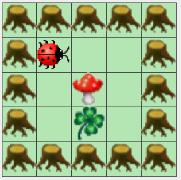
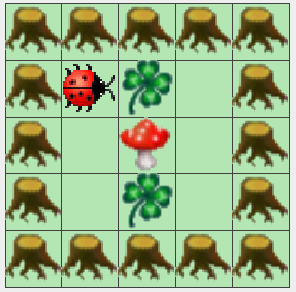
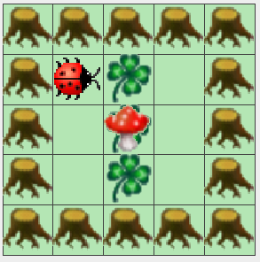
