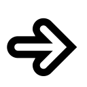

= Elektronische Prüfung zum Erwerb des Leistungsnachweises - Softwareentwicklung I
:icons: font
Prof. Dr. Ullrich Hafner <ullrich.hafner@hm.edu>
:toc-title: Inhaltsverzeichnis
:chapter-label:
:chapter-refsig: Kapitel
:section-label: Abschnitt
:section-refsig: Abschnitt

:xrefstyle: short
:!sectnums:
:partnums:
ifndef::includedir[:includedir: ./]
ifndef::imagesdir[:imagesdir: ./]
ifndef::plantUMLDir[:plantUMLDir: .plantuml/]
:figure-caption: Abbildung
:table-caption: Tabelle

ifdef::env-github[]
:tip-caption: :bulb:
:note-caption: :information_source:
:important-caption: :heavy_exclamation_mark:
:caution-caption: :fire:
:warning-caption: :warning:
endif::[]

== 1. Malen eines Rechtecks (Schleifen und Algorithmik) - Assignment1Draw

Damit der Start leichter fällt, ist die erste Aufgabe wieder in Teilschritte aufgeteilt, die im selben Programm umgesetzt werden sollen. Starten Sie mit der Aufgabenstellung zu Aufgabe 1a und verbessern Sie dann Ihren Code schrittweise so, dass er auch die Randfälle der weiteren Aufgaben erfüllt werden. Je nach Geschick kann die Lösung der weiteren Teilaufgaben bereits funktionieren, ohne dass Sie speziell nacharbeiten müssen. Die bereitgestellten Testfälle gelten jedenfalls für alle Teilaufgaben.

=== 1a. Malen eines kompletten Rechtecks

Schreiben Sie ein Programm für Kara, das in einer leeren Welt ein Rechteck vorgegebener Größe an einer bestimmten Position in der Welt malt. Der Eckpunkt links oben und die Breite und Höhe des Rechtecks werden durch einen Dialog zu Beginn abgefragt. Das Rechteck soll nicht gefüllt sein. Die Position von Kara am Ende des Programms ist egal und wird nicht überprüft.

In den folgenden Bildern sehen Sie einige Rechtecke, die Ihr Programm malen soll:

.Ausgangssituation XS (links) und erwartetes Ergebnis (rechts)
image:images/1-XS-Start.png[Ausgangssituation, width=30%, pdfwidth=30%]

image:images/1-XS-Expected.png[erwarteten Ergebnis, width=30%, pdfwidth=30%]

.Ausgangssituation S (links) und erwartetes Ergebnis (rechts)
image:images/1-S-Start.png[Ausgangssituation, width=30%, pdfwidth=30%]

image:images/1-S-Expected.png[erwarteten Ergebnis, width=30%, pdfwidth=30%]

.Ausgangssituation L (links) und erwartetes Ergebnis (rechts)
image:images/1-L-Start.png[Ausgangssituation, width=30%, pdfwidth=30%]

image:images/1-L-Expected.png[erwarteten Ergebnis, width=30%, pdfwidth=30%]

=== 1b. Malen eines degenerierten Rechtecks

Höhe und Breite eines Rechtecks können degeneriert sein. Das heißt, dass die Höhe oder die Breite 1 sein kann. Dann ergibt sich eine horizontale oder vertikale Linie. Sind beide Höhe und Breite 1, dann ergibt sich sogar nur ein Punkt. Sind  Höhe und Breite 2, dann ergibt sich ein ausgefülltes Rechteck.

=== 1c. Ignorieren von ungültigen Eingaben

Werden als Startpunkt Koordinaten außerhalb der Welt gewählt, soll Kara gar nichts malen. Ebenso soll bei Höhe und Breite kleiner 1 nichts gemalt werden.

=== 1d. Malen übergroßer Rechtecke

Sollte das zu malende Rechteck nicht ganz in Karas Welt passen (d.h., es ist zu breit oder lang), dann soll nur der sichtbare Bereich gemalt werden. Die restlichen Punkte, die außerhalb der Welt liegen, sollen nicht angezeigt werden. (Diese Punkte dürfen auch nicht auf der anderen Seite dargestellt werden, d.h. die typische Kara Funktionalität, dass Kara auf der jeweils gegenüberliegenden Seite wieder erscheint, wird nicht umgesetzt). Damit ergibt sich jeweils ein Rechteck mit einer oder zwei offenen Seiten.

.Ausgangssituation XL (links) und erwartetes Ergebnis (rechts) bei Eingabe Breite = 2 und Höhe = 6
image:images/1-XL-Start.png[Ausgangssituation, width=30%, pdfwidth=30%]

image:images/1-XL-2-6.png[erwarteten Ergebnis, width=30%, pdfwidth=30%]

.Ausgangssituation XL (links) und erwartetes Ergebnis (rechts) bei Eingabe Breite = 7 und Höhe = 1
image:images/1-XL-Start.png[Ausgangssituation, width=30%, pdfwidth=30%]

image:images/1-XL-7-1.png[erwarteten Ergebnis, width=30%, pdfwidth=30%]

== 2. Zerlegen von Dezimalzahlen (Thema: Schleifen und Rechnen) - Assignment2Digits

Kara soll nicht negative Dezimalzahlen im Bereit 0-999999 in Karas Welt zeichnen. Es gibt nur eine Welt in diese Aufgabe: Die Welt ist komplett leer und hat eine Breite von 6 (für jede Dezimalstelle eine Spalte) und eine Höhe von 9 (für die Darstellung der Ziffern 0 bis 9). Jede Dezimalstelle der jeweils einzugebenden Zahl muss in eine Spalte mit 0 bis 9 Blättern dargestellt werden. Das Auftragen der Blätter startet von unten, Lücken sind nicht erlaubt. Ganz links ist die höchstwertige Dezimalstelle, ganz rechts die niederwertigste angeordnet. Nicht benötigte Dezimalstellen bleiben leer. Stellen Sie außerdem sicher, dass bei einer Eingabe von Zahlen > 999999 oder < 0 nichts gemalt wird. Die Position von Kara am Ende des Programms ist egal und wird nicht überprüft.

Beispiele:

- die Zahl 0 lässt die Welt unverändert, wird also mit 0, 0, 0, 0, 0, 0 Blättern dargestellt. D.h. die Welt bleibt leer.
- Die Zahl 123 wird durch 0, 0, 0, 1, 2, 3 Blättern dargestellt. Die ersten drei Spalten bleiben daher leer.
- Die Zahl 21212 wird durch 0, 2, 1, 2, 1, 2 Blättern dargestellt. Die erste Spalte bleibt daher leer.
- Die Zahl 987654 wird durch 9, 8, 7, 6, 5, 4 Blättern dargestellt.

.Die Zahlen 0, 123, 21212 und 987654 aufgemalt in Karas Welt
image:images/2-0.png[Ausgangssituation, width=20%, pdfwidth=20%]
image:images/2-123.png[Ausgangssituation, width=20%, pdfwidth=20%]
image:images/2-21212.png[Ausgangssituation, width=20%, pdfwidth=20%]
image:images/2-987654.png[Ausgangssituation, width=20%, pdfwidth=20%]

== 3. Finden von Mustern (Thema: Arrays) - Assignment3Search

Kara soll ein Muster aus Blättern in einer Zeile der vorgegebenen Welt finden. Die Welt ist dabei wie folgt aufgebaut: Sie ist immer gleich hoch, aber beliebig breit. Die gesamte Welt ist mit Bäumen umrandet. Das zu suchenden Muster ist in der obersten begehbaren Zeile der Welt aufgetragen. Die unterste begehbare Zeile enthält dann den Ausschnitt, in dem nach dem Muster gesucht werden soll. Die Länge des zu suchenden Musters wird durch Pilze links und rechts daneben eingegrenzt. Ebenso der Bereich, in dem das Muster gesucht werden soll. Kara selbst steht in der Mitte zwischen diesen beiden Zeilen. Die mittlere Zeile ist sonst mit Bäumen gefüllt, um die obere von der unteren Zeile visuell zu trennen. Die Position von Kara am Ende des Programms ist egal und wird nicht überprüft.

Beispiele:

.In diesen Welten wird das Muster (Orange) jeweils in der unteren Zeile gefunden (grün)
image:images/3-treffer-start.png[Ausgangssituation, width=40%, pdfwidth=40%]
image:images/3-treffer-ende.png[Ausgangssituation, width=40%, pdfwidth=40%]

.In diesen Welten wird das Muster (Orange) nicht gefunden
image:images/3-kein-treffer-leeres-feld-fehlt.png[Ausgangssituation, width=40%, pdfwidth=40%]
image:images/3-kein-treffer-blatt-zuviel.png[Ausgangssituation, width=40%, pdfwidth=40%]

.In dieser langen Welt wird das Muster (Orange) auch in der unteren Zeile gefunden (grün)
image:images/3-lange-welt.png[Ausgangssituation, width=80%, pdfwidth=80%]

Hinweis: Wenn Sie es nicht schaffen, beliebig breite Welten zu unterstützen, können Sie auch mit der festen Weltgröße 9x5 aus den oberen Beispielen arbeiten. Damit erhalten Sie zumindest einen Teil der Punkte.

Lösungshinweis: Lesen Sie die beiden Zeilen in Arrays ein, und suchen Sie damit einen möglichen Treffer.

